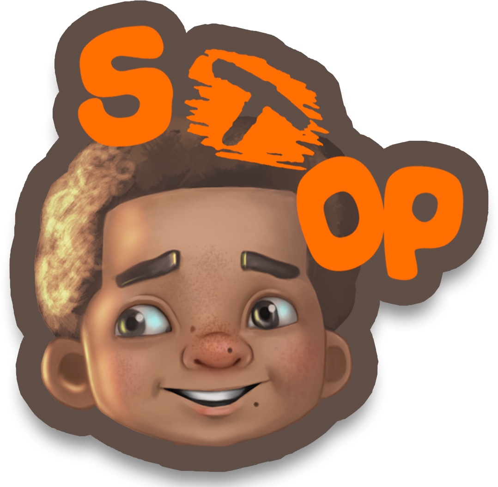
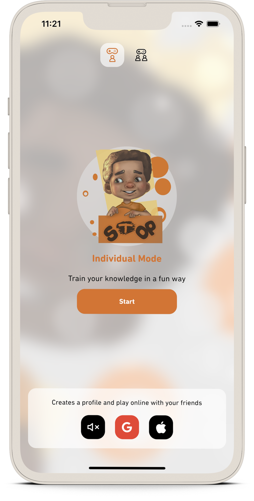
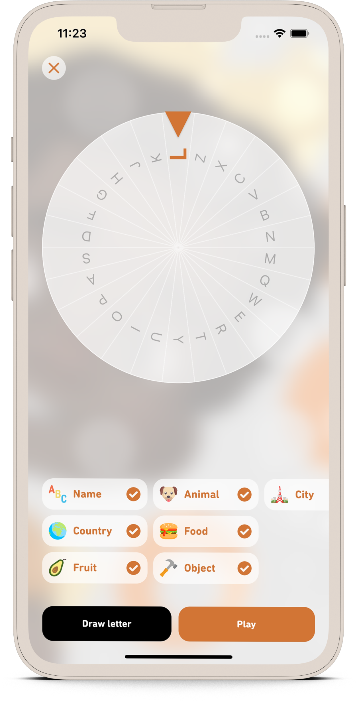
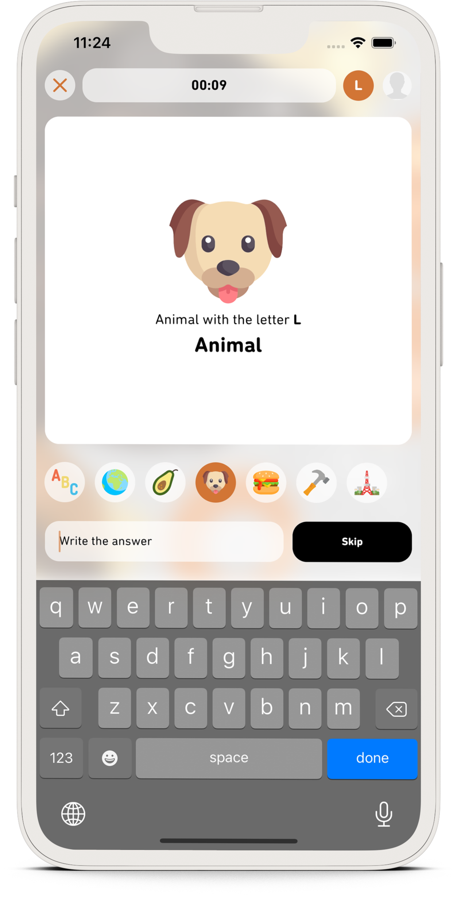
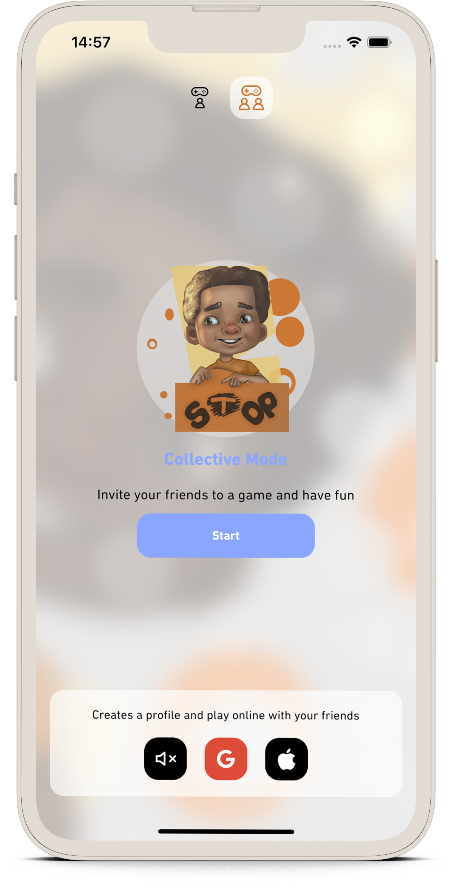

# stop

Don't let the joke die

    
 
 
 
  

## Description

This is the virtualization of a well-known prank.

STOP is a question and answer game, where two or more people participate, participants choose categories (Ex: Animal,
fruit, object, food, etc.) and a letter. The issues of the game are generated based on the categories chosen and players
must answer the questions based on the letter that was chosen (Ex: Name of an animal that begins with the letter L).

The game is finalized when one of the players finishes answering all the questions.

This application has 19 categories and a knowledge base with more than 95,000 words registered at the moment and with
the ability to apprehend with the user.

## 📸 Screenshots

    
    
  
    
    

